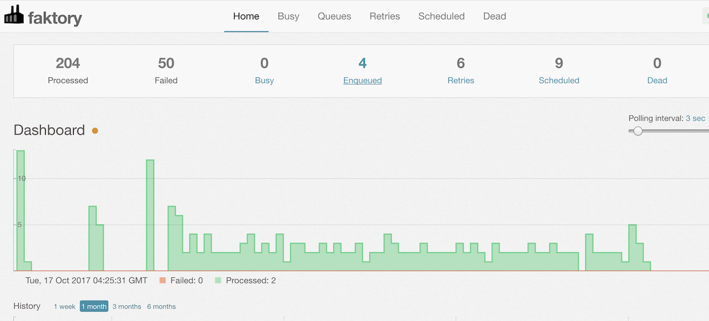

# Faktory

At a high level, Faktory is a work server.  It is the repository for
background jobs within your application. Jobs have a type and a set of
arguments and are placed into queues for workers to fetch and execute.

You can use this server to distribute jobs to one or hundreds of
machines.  Jobs can be executed with any language by clients using
the Faktory API to fetch a job from a queue.

## What does it look like?

Here's the Web UI.




## Basic Features

- Jobs are represented as simple JSON hashes.
- Jobs are pushed and fetched from queues.
- Jobs are reserved with a timeout, 30 min by default.
- Jobs not ACK'd or FAIL'd within timeout are requeued.
- FAIL'd jobs trigger a retry workflow with exponential backoff.
- Contains a comprehensive Web UI for management and monitoring.

## Installation

Standard 64-bit Linux builds are distributed via PackageCloud.io.  For Debian and Ubuntu:

```
curl -s https://packagecloud.io/install/repositories/contribsys/faktory/script.deb.sh | sudo bash
sudo apt-get install faktory
```

See the [PackageCloud repository](https://packagecloud.io/contribsys/faktory) for RPM and other options.

## How it works

Faktory listens on two ports:

* 7419 is the command port, clients connect and then PUSH or FETCH jobs.
* 7420 is the UI port for web browsers

See the [Security](/contribsys/faktory/wiki/Security) wiki page for
details about securing Faktory network access.

## Documentation

Please [see the Faktory wiki](/contribsys/faktory/wiki) for full documentation.

## Author

Mike Perham, @mperham, mike @ contribsys.com
